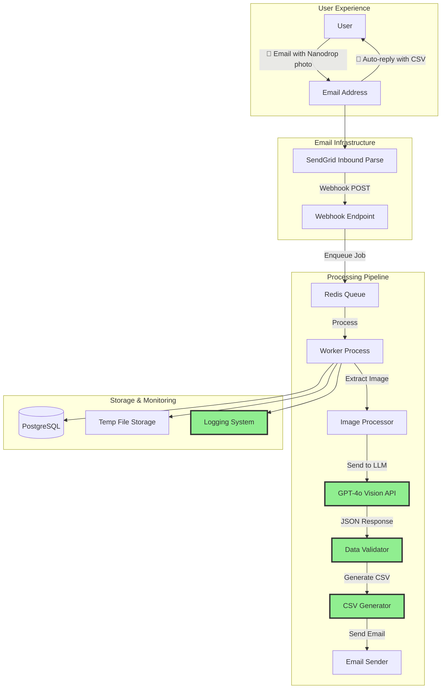
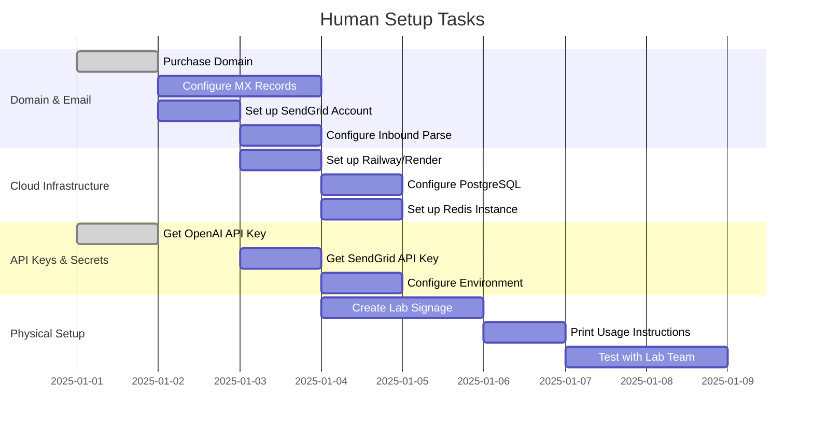
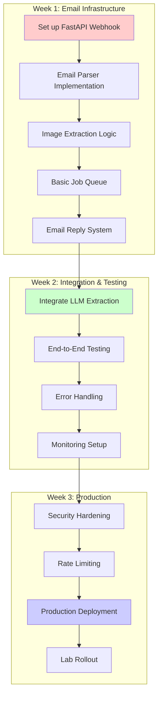

# Nanodrop Email Processing - Infrastructure Roadmap

## 🎯 Current Status: LLM Core Complete - Ready for Email Integration

The **hardest technical challenge** (100% accurate LLM extraction) is **SOLVED**. Now we need standard web infrastructure.

---

## 🏗️ MVP Infrastructure Architecture



**🟢 Green = Already Implemented**  
**⚪ White = Needs Implementation**

---

## 🚀 Human Tasks & Account Setup



---

## 📋 Detailed Human Action Items

### **🌐 1. Domain & Email Setup**
| Task | Action Required | Estimated Time |
|------|----------------|----------------|
| **Domain Purchase** | Buy `nanodrop-capture.com` (or similar) | 15 min |
| **MX Records** | Point to SendGrid: `mx.sendgrid.net` | 30 min |
| **SendGrid Account** | Sign up, verify domain | 30 min |
| **Inbound Parse** | Configure webhook URL in SendGrid | 15 min |

### **☁️ 2. Cloud Infrastructure**
| Task | Action Required | Estimated Time |
|------|----------------|----------------|
| **Hosting Platform** | Railway, Render, or DigitalOcean | 30 min |
| **PostgreSQL** | Provision managed database | 15 min |
| **Redis** | Set up Redis instance for job queue | 15 min |
| **Environment Variables** | Configure API keys securely | 20 min |

### **🔑 3. API Keys & Accounts**
| Task | Status | Action Required |
|------|--------|----------------|
| **OpenAI API** | ✅ **DONE** | Already have key with credits |
| **SendGrid API** | ❌ **TODO** | Get API key after account setup |
| **Cloud Platform** | ❌ **TODO** | API keys for deployment |

### **🏥 4. Lab Integration**
| Task | Action Required | Estimated Time |
|------|----------------|----------------|
| **Signage** | Design & print instructions for Nanodrop | 2 hours |
| **Email Address** | Set up `data@nanodrop-capture.com` | 10 min |
| **Documentation** | Create user guide for lab team | 1 hour |
| **Training** | Show lab team how to use system | 30 min |

---

## 🛠️ Engineering Implementation Plan



---

## 🎯 Immediate Next Steps (This Week)

### **Human Tasks (Priority Order)**
1. **🌐 Set up SendGrid account** - 30 minutes
2. **🌐 Purchase/configure domain** - 45 minutes  
3. **☁️ Choose hosting platform** - 30 minutes
4. **🔑 Gather all API keys** - 15 minutes

### **Engineering Tasks (Priority Order)**
1. **📧 Implement webhook endpoint** - 4 hours
2. **📎 Add email attachment parsing** - 2 hours
3. **🔗 Integrate with existing LLM system** - 2 hours
4. **📨 Implement email reply** - 3 hours
5. **🧪 End-to-end testing** - 2 hours

---

## 💰 Infrastructure Costs (Monthly)

| Service | Cost | Usage |
|---------|------|-------|
| **SendGrid** | $0-15 | Free up to 100 emails/day |
| **Railway/Render** | $5-20 | Basic web service |
| **PostgreSQL** | $5-15 | Managed database |
| **Redis** | $5-10 | Queue management |
| **Domain** | $12/year | nanodrop-capture.com |
| **OpenAI API** | $0.03/image | Variable based on usage |
| **Total Fixed** | **~$15-60/month** | Plus $0.03 per image |

---

## 🎪 Lab Signage Design

```
┌─────────────────────────────────────────┐
│  🧬 NANODROP DATA EXTRACTION SERVICE    │
├─────────────────────────────────────────┤
│                                         │
│  📱 Take photo of Nanodrop screen       │
│  📧 Email to: data@nanodrop-capture.com │
│  ⏱️  Get CSV results in 60 seconds      │
│                                         │
│  💡 Tips for best results:              │
│  • Include entire screen in photo       │
│  • Avoid glare/reflections              │
│  • Take photo straight-on               │
│  • Ensure screen is clearly visible     │
│                                         │
│  ❓ Questions? Contact: [lab manager]   │
└─────────────────────────────────────────┘
```

---

## 🎯 Success Criteria for MVP

- [ ] Email to `data@nanodrop-capture.com` works
- [ ] Photos are extracted from emails  
- [ ] LLM processes images with >95% accuracy
- [ ] CSV files are generated and emailed back
- [ ] End-to-end processing < 60 seconds
- [ ] Error handling sends helpful messages
- [ ] System handles 10+ emails per day reliably

---

## 🚀 Ready to Execute!

**The core extraction engine is proven.** Now it's just standard web development to wrap it in email infrastructure. 

**Next session focus:** Set up SendGrid and implement the webhook endpoint!