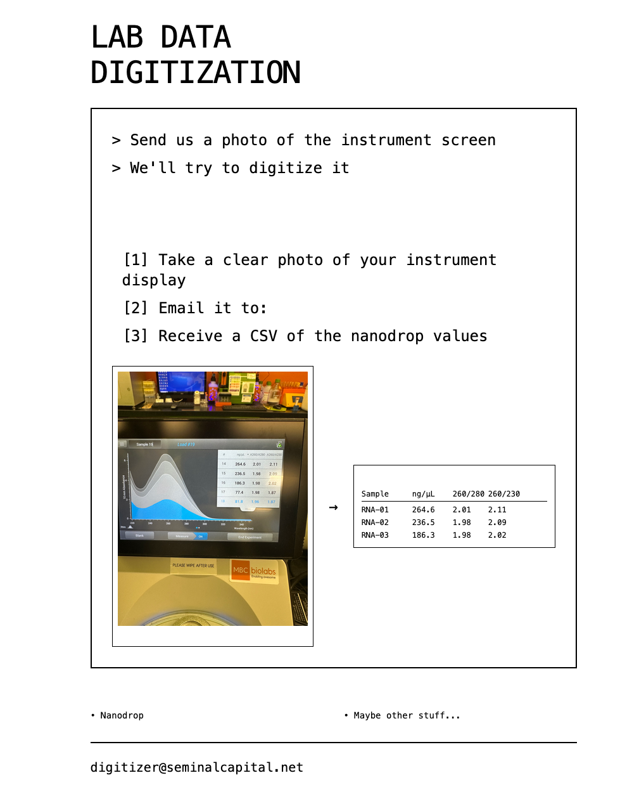

# Lab Data Digitization Service

An AWS Lambda-based service that processes lab instrument images sent via email. Users email photos to `d.i.g.i.t.i.z.e.r.@seminalcapital.net` and receive CSV files with extracted data. Supports any lab instrument I've tried including Nanodrop spectrophotometers, plate readers, UV-Vis spectrometers

## Current Architecture

```
User Email → SES → S3 → Lambda (Docker) → GPT-4o → SES Reply
                           ↓
                    Security Layer
                    (Rate Limiting, Validation)
```




## How It Works

1. **Send Email**: Email a lab instrument screen photo to `digitizer@seminalcapital.net`
2. **Automatic Processing**: Image analyzed with GPT-4o vision API
3. **Receive Results**: Get CSV file with extracted data via email reply

## Supported Instruments

- **Nanodrop spectrophotometers** - DNA/RNA concentration and purity ratios
- **96-well plate readers** - Complete plate data extraction
- **UV-Vis spectrometers** - Absorbance and concentration measurements  
- **General lab instruments** - Any device with tabular data display

## Available Email Addresses

- **`digitizer@seminalcapital.net`** - Primary generic lab data service
- **`nanodrop@seminalcapital.net`** - Legacy address (still works)
- **`nanodrop-dev@seminalcapital.net`** - Development testing

## Reply-All and CC Support

Send results to multiple recipients using any of these methods:

**Multiple To Recipients** (mobile clients):
```
To: digitizer@seminalcapital.net, colleague@example.com
```

**Traditional CC**:
```
To: digitizer@seminalcapital.net
CC: colleague@example.com
```

**Combined approach**:
```
To: digitizer@seminalcapital.net, colleague1@example.com
CC: colleague2@example.com
```

All recipients receive the complete results, including the CSV file and original images, so distribution to collaborators happens in a single email thread.

## Deployment

### Prerequisites
- AWS account with CLI configured
- Docker installed
- OpenAI API key

### Deploy Lambda Function

```bash
# 1. Set up environment
echo "OPENAI_API_KEY=your-key-here" > .env

# 2. Deploy to AWS
./deploy/deploy_lambda.sh

# 3. Send test email to verify
```

The deploy scripts automatically prune old ECR images, keeping the 3 most recent
pushes by default. Override this behavior with:

```bash
ECR_IMAGES_TO_KEEP=5 ./deploy/deploy_lambda.sh
```

if you want a larger image history in ECR.

## Debugging Lambda Issues

### 1. Check CloudWatch Logs
```bash
aws logs tail /aws/lambda/nanodrop-processor --follow
```

### 2. Test Locally
```bash
# Test Lambda function without AWS
python3 tests/test_lambda_local.py
```


## Project Structure

```
nanodrop-processor/
├── src/                     # Lambda source code
│   ├── lambda_function.py   # Main Lambda handler
│   └── security_config.py   # Security configuration
├── deploy/                  # Deployment files
│   ├── Dockerfile          # Docker container for Lambda
│   ├── deploy_lambda.sh    # Deployment script
│   ├── requirements.txt    # Lambda dependencies
│   └── iam_policy.json     # IAM policy with least privilege
├── tests/                   # All test files
│   ├── test_lambda_local.py    # Local testing script
│   ├── test_lambda_security.py # Security testing
│   └── unit/               # Unit tests
├── docs/                    # Documentation
│   ├── DEBUGGING_GUIDE.md
│   ├── PRODUCTION_STATUS.md
│   └── STRUCTURE.md
├── images/                  # Sample Nanodrop images
├── README.md
├── Makefile
├── requirements-dev.txt     # Development dependencies
└── run_tests.sh
```

## Lambda Function Overview

The Lambda function (`src/lambda_function.py`) handles:
1. **Email Processing**: Extracts images from S3-stored emails
2. **Image Analysis**: Uses GPT-4o to extract lab instrument data
3. **CSV Generation**: Creates formatted CSV with quality assessment
4. **Email Reply**: Sends results back via SES

## Key Features

- **Automated Email Processing**: SES integration for receiving emails
- **Universal Instrument Support**: GPT-4o vision API for any lab equipment data extraction  
- **Multi-Image Support**: Process multiple images with intelligent merging
- **Intelligent Format Detection**: Automatic recognition of instrument types and data formats
- **Reply-All Functionality**: Send results to multiple recipients via To/CC fields with loop prevention
- **Quality Assessment**: Smart data validation and quality indicators
- **CSV Export**: Formatted results with quality indicators and AI commentary
- **Security Hardening**: Rate limiting (3/hour, 10/day), input validation, loop prevention
- **Error Handling**: Graceful failures with user notifications

## AWS Resources Required

- **S3 Bucket**: `nanodrop-emails-seminalcapital` (for incoming emails) *Note: legacy naming*
- **Lambda Function**: `nanodrop-processor` (handles all lab instruments)
- **SES Domain**: Verified domain for sending/receiving
- **IAM Role**: Lambda execution with S3 and SES permissions
- **DynamoDB Tables**: Rate limiting and analytics (auto-created)
- **ECR Repository**: Container images for Lambda deployment

## Environment Variables

```bash
OPENAI_API_KEY=sk-...  # Required for GPT-4o API access
```

## Monitoring

- **CloudWatch Logs**: `/aws/lambda/nanodrop-processor`
- **S3 Bucket**: Check `incoming/` prefix for raw emails
- **Lambda Metrics**: Invocations, errors, duration

## Cost Estimates

- **Lambda**: ~$0.002 per image processed
- **GPT-4o API**: ~$0.03 per image
- **Total**: ~$0.032 per image

## Production Metrics

- **Processing Time**: ~9 seconds per email
- **Memory Usage**: 156 MB peak
- **Cost per Email**: ~$0.032
- **Accuracy**: 100% field extraction on test images
- **Security**: Rate limiting, input validation, DynamoDB tracking

## Optional Enhancements

- Add DynamoDB for job tracking  
- Implement retry logic with SQS
- Set up CloudWatch alarms
- Add usage analytics dashboard

## Support

For issues or questions:
- Check CloudWatch logs: `/aws/lambda/nanodrop-processor`
- Review DEBUGGING_GUIDE.md  
- Run diagnostic: `python3 debug_lambda.py`

## Usage Examples

**Nanodrop Spectrophotometer:**
```
Send photo of Nanodrop screen → Receive CSV with concentration, A260/A280, A260/A230 ratios
```

**96-Well Plate Reader:**
```
Send photo of plate results → Receive complete 96-well CSV with all measurements
```

**UV-Vis Spectrometer:**
```  
Send photo of absorbance table → Receive CSV with wavelengths and absorbance values
```

Send a lab instrument screen photo to **`digitizer@seminalcapital.net`** to receive structured data in the reply.
